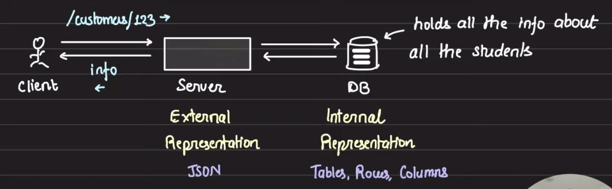

## REST (Representational State Transfer)

- REST is how a browser interacts with API servers.
- Representational : Representation of the entities is central to this idea
- Everything in REST is a resource, for exp. if you are building Library Management System, student/book is a resource
- REST is a specification on how the client should be asking things from server (how client and server should communicate), although REST cannot enforce on how we store our data inside services / database.
- The client has an option to ask server to send data in a particular format -> content-type header.

- REST does not enforce a certain protocol, but it is commonly implemented over http.

### HTTP and REST

- HTTP verbs (Get, Put, Post etc) made it easy for HTTP and Rest to work together.
- DELETE /user:userId : delete the resource of type 'user' identified by 'userId'
- Action is specified by HTTP method and resource is specified by URL
- REST says use HTTP methods wisely but the URL should be the identification of your resource.
-
